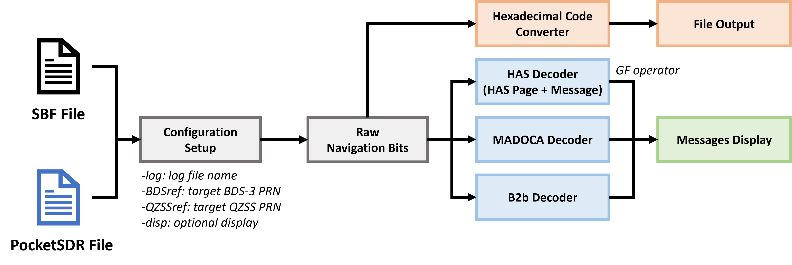

# **CSSR-tool**
## **Overview**

CSSR-tool converts all source CSSR messages into one text file. The file accumulates QZSS MADOCA, Galileo HAS and BDS-3 B2b messages with its corresponding GPS time, PRN number and HEX code. It can be utilized as an input of coorperative CSSR-PPP. Users can arbitrarily select which service should be included in the output text file.

Note: Users must input SBF file to run the software; however, the PocketSDR file is optional. Besides, this package also supports message contents display. Please refer to the options below.



--------------------------------------------------------------------------------

## **Contents**
```
CSSR-tool --+-- src     CSSR-tool C programs
            |   +--     rtklib.h (Inherited from RTKlib) 
            |   +--     cssr.h
            |   +--     pksdr_mt.h
            |   +--     sbf_mt.h
            |   +--     gflib.h
            |   +--     cssr_main.c
            |   +--     cssr_bds.c
            |   +--     cssr_has.c
            |   +--     cssr_mdc.c
            |   +--     decode_sbf.c
            |   +--     log_func.c
            |   +--     galois.c
            |   +--     gflib.c
            |   +--     rtkcmn.c (Inherited from RTKlib) 
            |   +--     stream.c (Inherited from RTKlib)
            +-- log     CSSR-tool log file output
            |   +--     CSSR-tool log file link
            +-- data    CSSR-tool sample data link
```
--------------------------------------------------------------------------------

## **Installation**

The software has been tested in CLION 2023.3.2. Please create a project to build the software.

* Download and unzip the software into your directory <install_dir>.
* Open the folder as a CLION project
* Modify the CMakeList.txt to link the software to your directory
```
set(LINK_DIR <install_dir>)
```
* Reload the CMakeList.txt

There are several arguments that need to specify in cssr_main.c, please refer to the description in the file.

**Note: Users must input SBF file to run the software; however, the PocketSDR file is optional. Besides, this package also supports message contents display.**

## **Citation**
Under review

## **Contributor**
* **Cheng-Wei Wang** (jlurgbuf1234@gmail.com)

## **References**
[1] https://github.com/tomojitakasu/PocketSDR/tree/master 

[2] https://github.com/tomojitakasu/RTKLIB

[3] https://github.com/hirokawa/cssrlib

[4] https://web.eecs.utk.edu/~jplank/plank/gflib/
